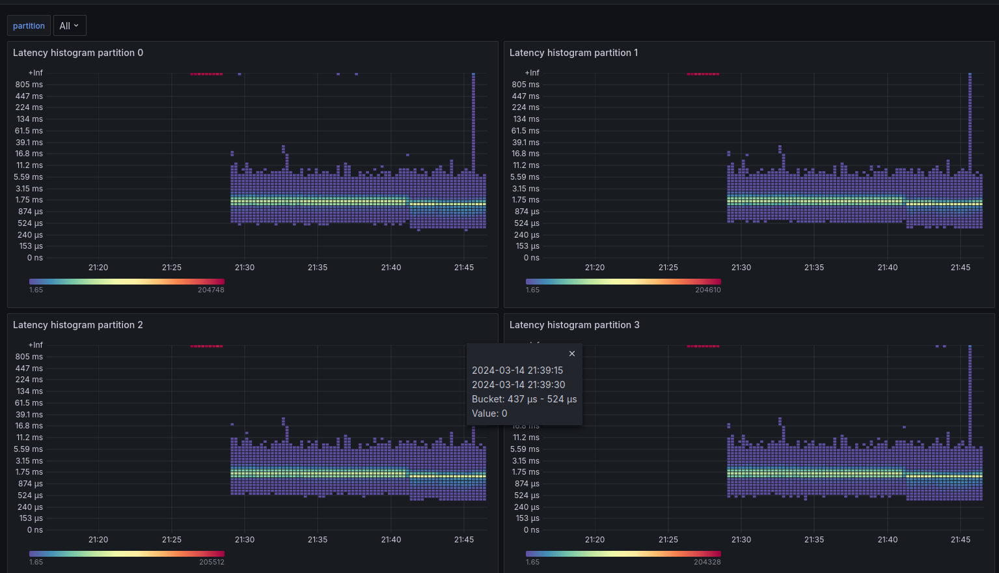

# Kafka Rebalancing

Project to experiment with Kafka partition rebalancing and find the best settings.

It consists of an API that allows to:
* start/stop producer for configured topic
* add/remove consumer with specific consumer group

Application reports consumer's latency histogram as micrometer metrics.

Histogram can then be scraped by Prometheus and displayed in grafana. Dashboard defined in [latency-dashboard.json](latency-dashboard.json) file.

